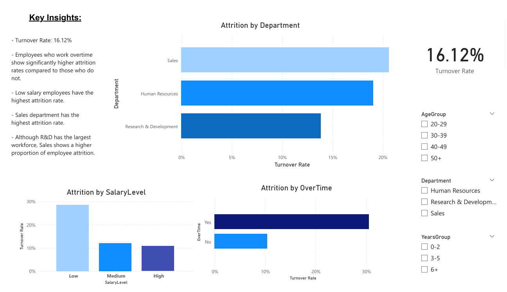

# HR-Analytics-Dashboard-Employee-Turnover-Satisfaction-Analysis
HR Analytics Project (Excel, Power BI) Analyzed employee attrition and satisfaction data Built an interactive dashboard using Power BI Identified key drivers of employee turnover (salary, overtime, job role) Delivered actionable HR recommendations based on data insights

# Project Overview
This project analyzes employee attrition and satisfaction to identify the key factors influencing employee turnover.
The goal is to provide data-driven insights that help HR teams improve employee retention and workplace satisfaction.

# Tools Used
- * **Excel** – Data cleaning & feature engineering
- **Power BI** – Data visualization & dashboard creation

# 1. Business Understanding
The objective of this project is to:
- Analyze employee attrition (turnover)
- Understand factors affecting employee satisfaction
- Identify key drivers of employee departure
- Provide actionable HR recommendations based on data insights

# 2. Dataset
* IBM HR Analytics Employee Attrition Dataset (Kaggle)
[https://www.kaggle.com/datasets/pavansubhasht/ibm-hr-analytics-attrition-dataset](https://www.kaggle.com/datasets/pavansubhasht/ibm-hr-analytics-attrition-dataset)

# 3. Data Cleaning (Excel )
Performed the following steps:
- Handled missing values
- Removed duplicates
- Standardized categorical columns (Department, Job Role, etc.)
- Converted categorical values:
   - Attrition → Yes / No
   - Satisfaction → Numeric scale

## Feature Engineering (important!)
Created new features to improve analysis:
* Age Group (20–29, 30–39, etc.)
* Salary Level (Low / Medium / High)
* Years at Company Group (0–2, 3–5, 6+)

# 4. Data Analysis (Excel)
Performed exploratory data analysis:
 * Calculated **Attrition Rate (%)**
 * Analyzed attrition by:
   * Department
   * Salary Level
   * Overtime
   * Years at Company 
  ## Turnover Rate
% of employees who left
  ## Analyze by:
- Department
- Age Group
- Years Group
  ## Satisfaction Analysis
Compare satisfaction vs attrition

## 5 Power BI Dashboard
### KPIs
* Overall Attrition Rate (%)
### Visualizations
* Attrition Rate by Department
* Attrition Rate by Salary Level
* Attrition Rate by Overtime
### Filters (Slicers)
* Department
* Age Group
* Years at Company

# 6. Key Insights 
- Overall attrition rate is **16.12%**.
- Employees working overtime show significantly higher attrition rates.
- Employees with **low salaries** have the highest attrition rate.
- The **Sales department** has the highest attrition rate.
- Although R&D has the largest workforce, Sales shows a higher proportion of employee attrition
  
##  Key Metrics
- Turnover Rate: 16.12%

##  Dashboard

##  Recommendations
- Improve work-life balance by reducing excessive overtime.
- Review compensation policies for low-salary employees.
- Focus retention strategies on high-risk departments (e.g., Sales).
- Improve onboarding and support for new employees.

##  Author
- Chourouk

